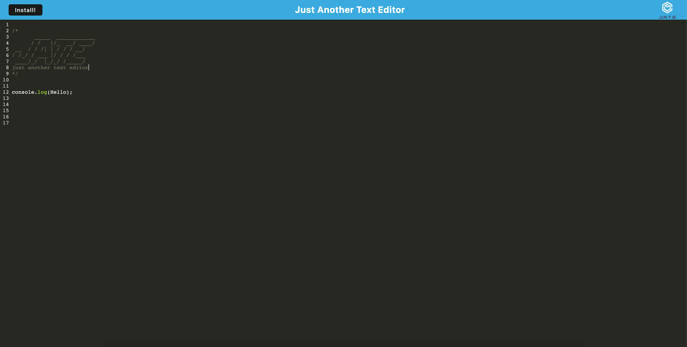
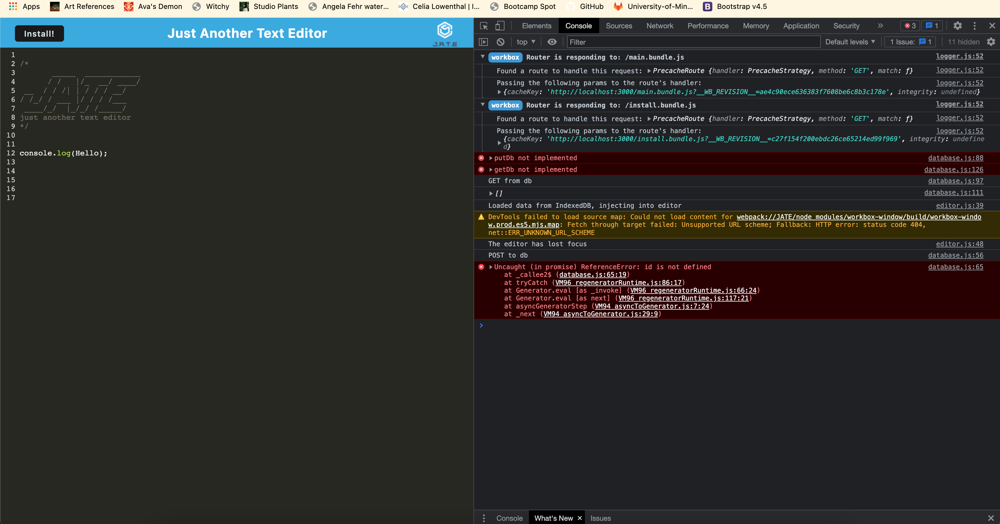
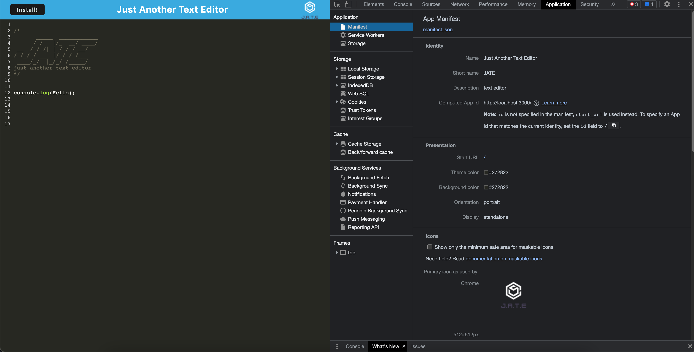
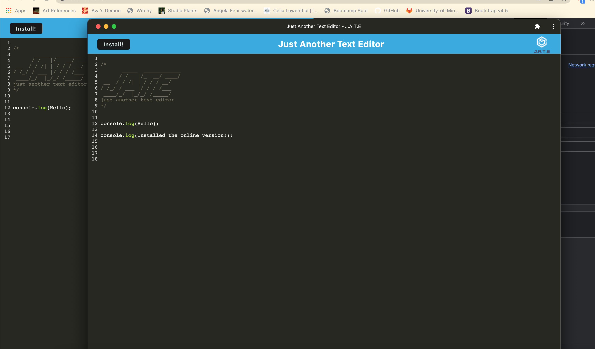

# Text-Editor

## Table of Contents
- [Description](#description)
- [Installation](#installation)
- [How-To](#how-to)
- [Screenshots](#screenshots)
- [Contributors](#contributors)
- [Questions](#questions)

  
# [Description](#table-of-contents)

The goal of this project was to build a single page application using IndexDB meeting PWA critteria. This app is a text editor that can be run using the broswer or alternatively be installed to function offline, so that you can creat notes or code snippets with or without an internet connection and retrieve them at a later time.

## [Installation](#table-of-contents)

To run the application you will need to install al of the dependencies in package.json files.

## [How-To](#table-of-contents)

Once all the packages are installed, just type `npm run start` to get everything going.

## [Screenshots](#table-of-contents)

### App

### Console

### Manifest

### Service worker

### Offline

## [Contributors](#table-of-contents)

To contribute to the text editor, please clone this repo locally and commit your code on a separate branch.

## [Questions](#table-of-contents)

Have any questions, comments or concerns? feel free to contact me

My Github username is [cccumar](https://github.com/CCCCUMAR)

This is the Github page for this [project](https://github.com/CCCCUMAR/text-editor)

My Email is [umar-19@live.com](umar-19@live.com)

Here is the Deployed [Application]()

